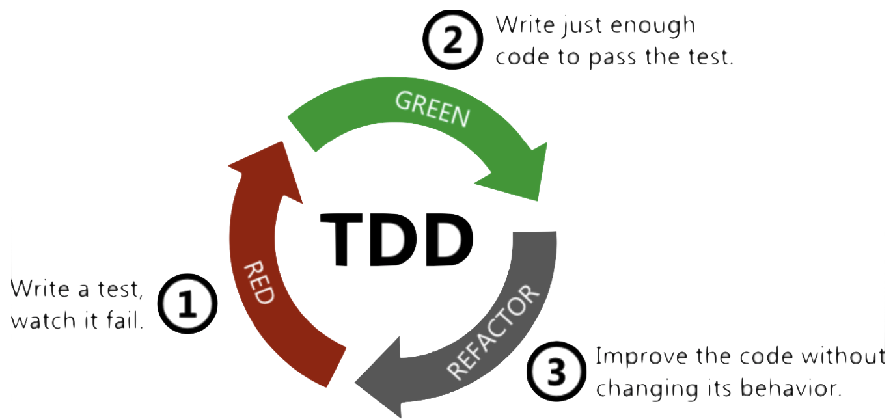
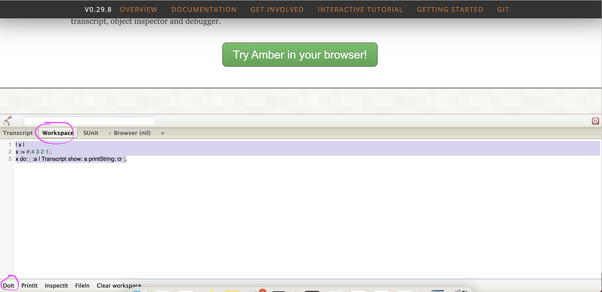
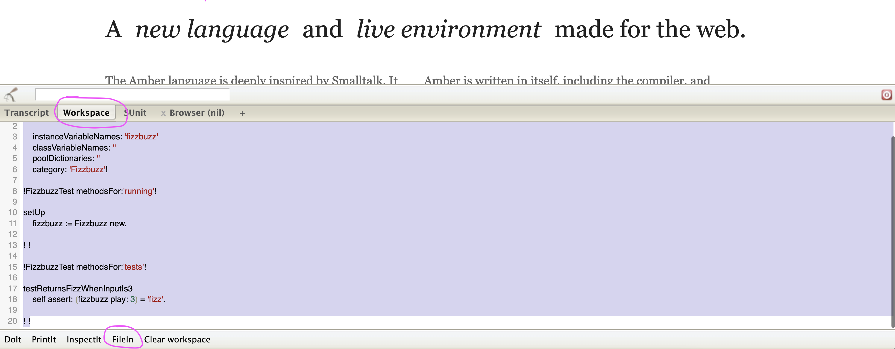
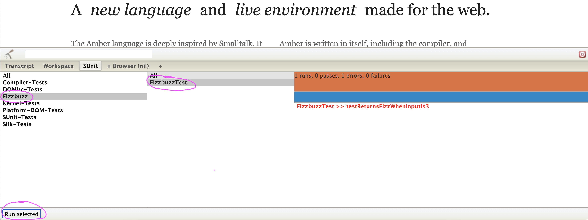
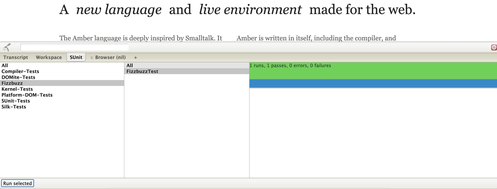
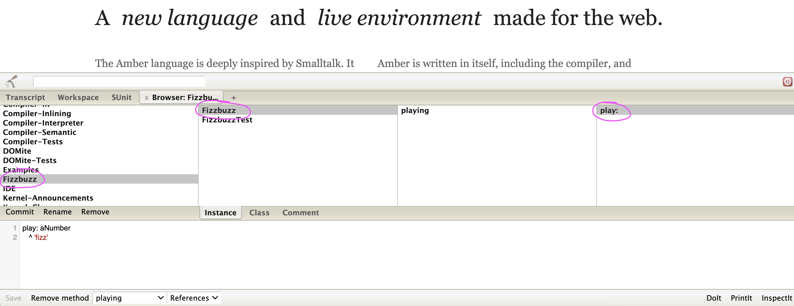

# Implementing Fizzbuzz in Smalltalk using TDD
  
Test-Driven Development (TDD) is a technique that helps us to design better software, faster, and in a sustainable pace.  
In order to create software that is testable, we need design it in such a way that
we can interact with it and capture the results of those interactions so that we can match them by using assertions in our tests.  
  
**Testable code** is naturally more modular, highly cohesive, loosely coupled, has better
separation-of-concerns, and is better abstracted (with well-thought-of interfaces). These are the hallmarks of good software design.
  
*TDD is less about testing and more about good design.*  
  
TDD is focused on using small tests to design systems from the ground up in an emergent manner, and to rapidly get value while building confidence in the system.
  
## How to do it?
  

  
1. Write a test
1. Check it fails
1. Write the most simple code to make it pass
1. Check the test passes
1. Refactor as needed
  
## Smalltalk

[Smalltalk](https://wiki.c2.com/?SmalltalkInOnePage) is a pure object-oriented, dynamically-typed and funny language with very few and simple syntax rules. You can run Smalltalk using Amber, a Javascript-based implementation that can run on your machine using Node.js or directly on your browser as follows:
1. go to the [Amber](https://www.amber-lang.net/) website
1. click on the green button to open the dev tools
1. select the *Workspace* tab
1. stick your code on it
1. select it and hit the *Doit* button; *only selected code is executed*  
  
  

## Our exercise
  
We need to write a function that:  
1. For each number divisible by three must return the word “fizz”
1. For each number divisible by five must return the word “buzz”
1. For each number divisible by three and by five must return the word “fizzbuzz”
1. For all the other numbers must return the input number 

I gave it a whirl on my own and the outcome of my attempt can be found on the [src](src) folder.
As prescribed by TDD, I have iterated towards the final solution being progressively guided by additional tests, one at a time. The test and solution files I created at each iteration are numbered from 1 to 5.  
  
If you need some help to start the exercise for not being familiar with Smalltalk, open the [Fizzbuzz-1Test.st](src/Fizzbuzz-1Test.st) file, copy all the code and paste it on the *Workspace* tab as described previously. Select it all and hit the *FileIn* button as shown below:  
  

  
Amber comes with [SUnit](https://en.wikipedia.org/wiki/SUnit), the unit testing framework created by Kent Beck in 1998 that is the mother of all **xUnit** frameworks. You can find the test class we have just loaded in the environment by following these steps:
1. open the *SUnit* tab
1. click on any package on the left pane; the pane's content will be updated showing **Fizzbuzz**
1. unselect everything else but *Fizzbuzz* package on the left and **FizzbuzzTest** test class on the middle
1. click on the *Run selected* button at the bottom  
  
The `testReturnsFizzWhenInputIs3` test case runs and an error pops up on the pane at the right because the `Fizzbuzz` class referred to in the `setUp` method has not been created yet.  
  
  
  
You can fix this error by creating the missing class: open the [Fizzbuzz-1.st](src/Fizzbuzz-1.st) file this time and repeat the same steps you did for `Fizzbuzz-1Test.st`. Hit the *Run selected* button and see the test pass.  
  

  
You can browse and change both classes you have just loaded:
1. open the *Browser* tab
1. click on any package on the left pane; the pane's content is going to be updated showing **Fizzbuzz**
1. select the **Fizzbuzz** package
1. select either of the classes on the middle pane; its methods will show up on the pane at the far right
1. select the method name 
1. the method body will show up on the pane at the bottom; you can edit the code and hit the *Save* button to save the change, if you like  
  
  
  
You can now keep going by creating another test case on the `FizzbuzzTest` class, seeing it fail, updating the logic in the `Fizzbuzz>>play` method, seeing the test pass, and then refactoring.  
Repeat until you have covered all four success criteria defined in the game description at the beginning of this section.
